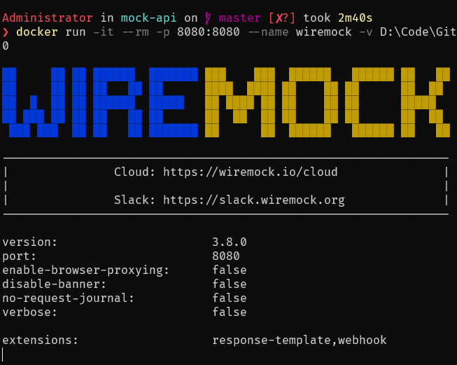
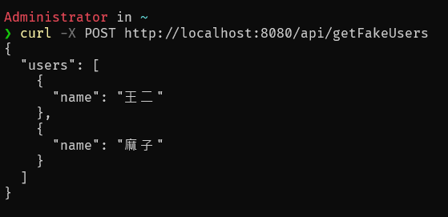

## 準備

以下指令是以 repository 存放在 `d:\temp\mock-api` 目錄下為例

## 啟動模擬

透過 docker 搭建一個 WireMock 服務，透過設定檔案來模擬後端 API SERVER 的回應，使用上較輕鬆方便

```
docker run -it --rm -p 8080:8080 --name wiremock -v D:\temp\mock-api:/home/wiremock wiremock/wiremock:3.8.0
```



透過掛載的方式將設定的目錄 `D:\temp\mock-api`指定對應到容器內的預設路徑 `/home/wiremock`

## 請求模型

在模擬回應的設置上，可以使用 `Template`，詳細資料參考[請求模型](https://wiremock.org/docs/response-templating/)的說明，最基礎的用法就是將模擬的回應建立 `json`檔案，並於 `mapping`設定中指定該檔案

```json
// /home/wiremock/mappings/get-fake-user.json
{
    "request": {
        "method": "POST",
        "url": "/api/getFakeUsers"
    },
    "response": {
        "status": 200,
        "headers": {
            "Content-Type": "application/json"
        },
        "bodyFileName": "users-response.json"
    }
}

// /home/wiremock/__files/users-response.json
{
  "users": [
    {
      "name": "王二"
    },
    {
      "name": "麻子"
    }
  ]
}

```

## 測試

透過 `Postman` 或其他同性質工具測試，向模擬的 endpoint 發送請求 `http://localhost:8080/api/getFakeUsers` 即可得到模擬的回應

```
curl -X POST http://localhost:8080/api/getFakeUsers
```



## 參考資料

1. [官網](https://wiremock.org/docs/standalone/java-jar/)
